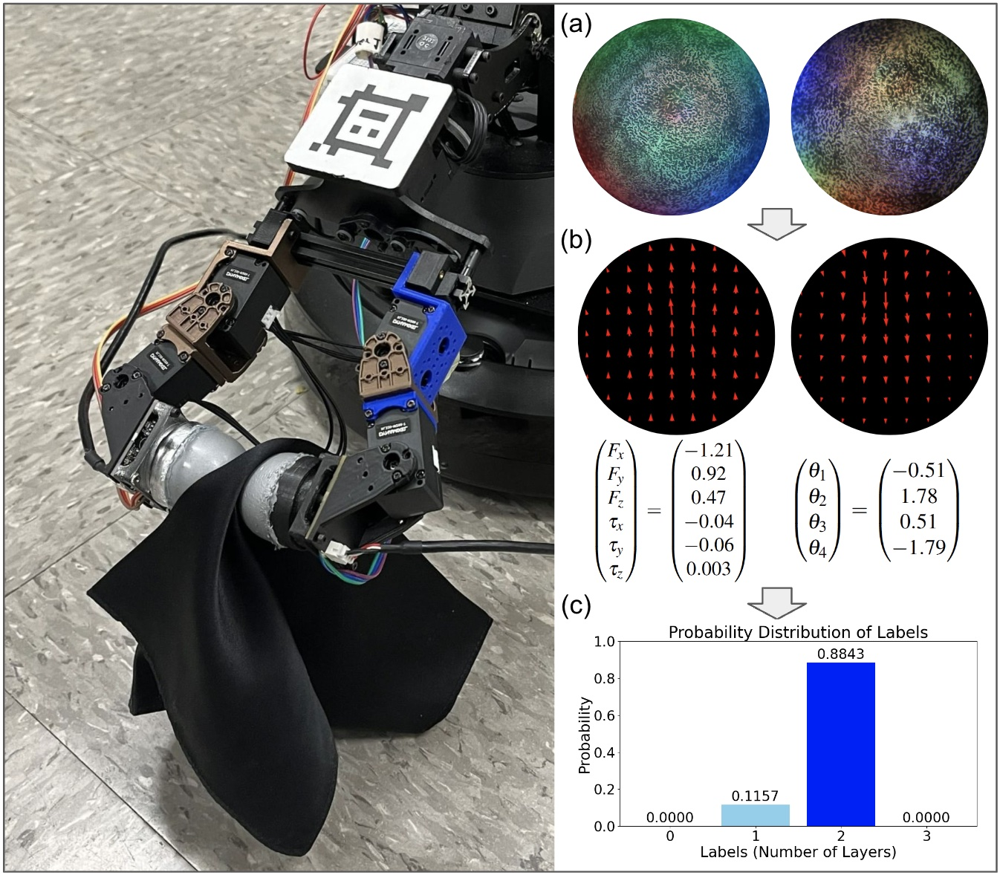

# Dynamic Layer Detection of a Thin Silk Cloth using DenseTact Optical Tactile Sensors

### [Camille Chungyoun*](https://arm.stanford.edu/people/camille-chungyoun), [Ankush Dhawan*](https://arm.stanford.edu/people/ankush-dhawan), [Karina Ting*](https://arm.stanford.edu/people/karina-ting), [Monroe Kennedy III](https://monroekennedy3.com/)

Submitted to _International Conference on Robotics and Automation 2025_

<!-- insert image here -->


This repo contains code for the Dynamic Cloth Detection Project

View our [project website](https://armlabstanford.github.io/dynamic-cloth-detection)

View our paper on [Arxiv]((https://arxiv.org/abs/2409.09849))

## Repo Structure

The structure of the repo is as follows:

* `models`: Python code for the models presented in the ablation study
* `src`: Contains the ROS2 code responsible for running the DenseTact sensors and the gripper rubbing motion
* `data_processing`: Contains scripts used to pre-process data, as well as code used to generate plots
* `test_scripts`: Useful scripts that were useful for testing connections to the Dynamixel motors and the DenseTact sensors

## Setup

To get set up, clone the repo: `git clone https://github.com/armlabstanford/dynamic_cloth_detection.git`

Install the requirements: 

```
cd dynamic_cloth_detection
pip3 install -r requirements.txt
```

## Running a model

Follow these steps to run a model: 
* To start, download the dataset from [here](https://zenodo.org/records/13328677). Data here is contained in zip files. Extract the data to reveal NPZ files for the input data. 
* Open a model you wish to run. Update the `data_path` variable reflecting where the data is downloaded.
* Run a model with python: `python3 <FILENAME>.py`
* When a model has finished running, 4 folders will be created: plots, best_model, test_confusion_matrices, and train_confusion_matricies. These folders contain the relevant information needed to evaluate the model performance. 

## Running a data collection trial

Follow these steps to run a data collection trial:
* Connect the OpenRB motor controller, Sensor 1, and Sensor 2 USB cables to the computer used to run the data collection trial.
* Check that your computer recognizes the devies by running the scripts available in the `test_scripts` directory with python: `python3 test_scripts/<SCRIPT_NAME>`
* Build the workspace: `colcon build`. Ensure that the packages `dynamixel_fingers`, `soft_object_manip_locobot`, and `vtnf_camera` all successfully build
* Run a data collection trial with the following command: `ros2 launch vtnf_camera roll_test_launch.py "id1:='<SENSOR_1_ID>'" "id2:='<SENSOR_2_ID>'" "num_layers:='<NUM_LAYERS>'" "trial_num:='<TRIAL_NUM>'"`, replacing the variables with the relevant inputs. A data collection trial will take about 20 seconds to run, and will save data automatically to your local computer with video stream data from both fingers, net wrench data, and joint state data. 
